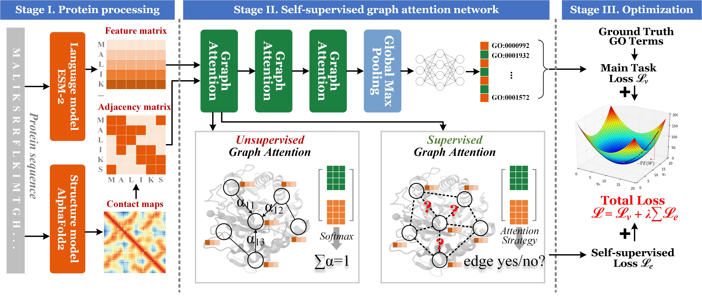

# SuperEdgeGO: Edge-Supervised Graph Representation Learning for Enhanced Protein Function Prediction
## The overall architecture of SuperEdgeGO

## Adjacency matrix and feature matrix
The input protein sequence is first sent to the protein language model ESM-2 to generate the feature matrix, and to the protein structure model AlphaFold2 to predict structures, which is eventually processed as the adjacency matrix.

## Dataset
AlphaFold2-predicted protein structures were obtained as the structural information of protein samples, while their corresponding function labels were collected from the gene ontology (GO) annotation labels, aka GO terms.
